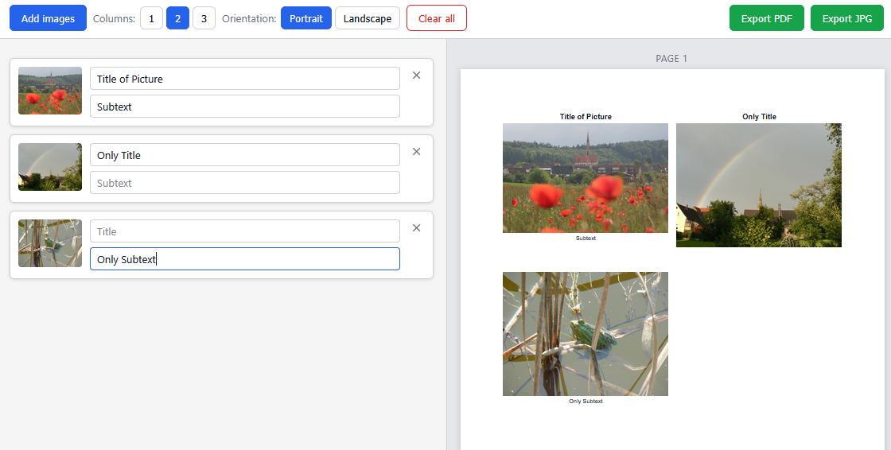

# Simple Local Image Printer

A browser-based tool to compose and export images on A4 pages — no server, no uploads, fully local.

## Quick Start

```bash
docker run -p 8080:80 ghcr.io/mstroppel/simple-local-image-printer:latest
```

Then open `http://localhost:8080`.

## What it does

Load images from your device, arrange them in a grid, optionally label each one, then export the result as a PDF or JPG. Everything runs in the browser; no data ever leaves your machine.

## Features

- Select multiple images from your device
- Optionally add a **title** (displayed bold above the image) and a **subtext** (displayed below the image) to each image
- Choose grid columns (1, 2, or 3 per row)
- Reorder images via drag-and-drop
- Automatic page breaks when images overflow a single A4 page
- Preview the composed A4 pages in real time
- Export to PDF (multi-page) or JPG (one image per page, downloaded as zip)

## Screenshot



## Tech stack

| Concern       | Choice                                                                                                             | Rationale                                                      |
| ------------- | ------------------------------------------------------------------------------------------------------------------ | -------------------------------------------------------------- |
| Frontend      | Vanilla JS + HTML + CSS                                                                                            | No build step, zero framework overhead, served as static files |
| Drag-and-drop | [SortableJS 1.15](https://sortablejs.github.io/Sortable/) (CDN, pinned)                                            | Lightweight, no dependencies                                   |
| PDF export    | [jsPDF 2.5](https://github.com/parallax/jsPDF) + [html2canvas 1.4](https://html2canvas.hertzen.com/) (CDN, pinned) | Fully client-side, well maintained                             |
| JPG export    | html2canvas (same lib) + [JSZip 3.10](https://stuk.github.io/jszip/) (CDN, pinned)                                 | Reuses the PDF rendering pipeline; zip for multi-page output   |
| Container     | nginx:1.27-alpine (pinned)                                                                                         | Minimal image to serve static files                            |
| CI/CD         | GitHub Actions                                                                                                     | PR validation + image publish on merge/tag                     |

**Browser support:** Chrome, Firefox, Edge, Safari (latest 2 versions).

## Requirements

- One of: Docker, Node.js (for `npx serve`)
- A modern desktop browser (Chrome, Firefox, Edge, Safari)

## Usage

### With Docker (recommended)

```bash
docker run -p 8080:80 ghcr.io/mstroppel/simple-local-image-printer:latest
```

Open `http://localhost:8080` in your browser.

### Local development

No build step required. Serve the `src/` directory with any static file server:

```bash
npx serve src/
```

## Limitations

- Supported image formats: JPEG, PNG, GIF, WebP, TIF/TIFF
- TIFF files are decoded in the browser via UTIF.js; only the first image/page is used, and uncommon TIFF encodings may fail to load
- Files larger than 50 MB are rejected

## License

MIT — see [LICENSE](LICENSE).
